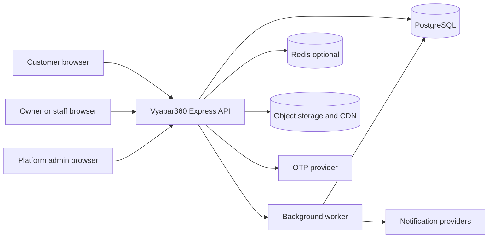
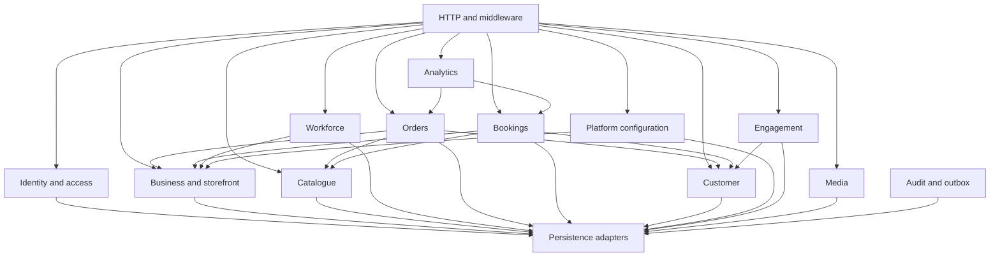
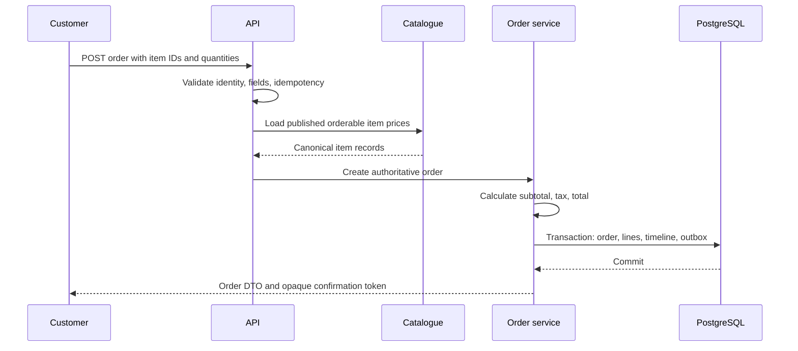
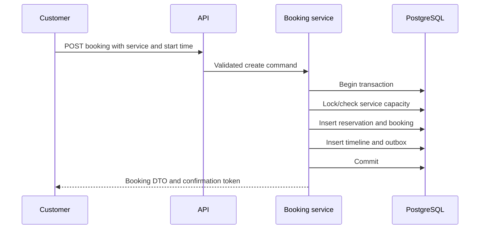
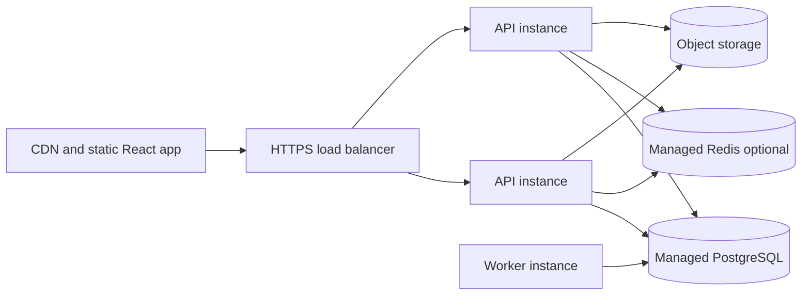

# High-Level Design

## 1. Architecture choice

Vyapar360 should begin as a modular monolith:

- one deployable API application;
- one background worker deployable from the same codebase;
- one PostgreSQL database with schema ownership by module;
- optional Redis for distributed rate limits, OTP challenges, short-lived
  coordination, and cache;
- object storage plus CDN for images.

This provides transactional consistency for orders, bookings, entitlements, and
tenant boundaries without introducing distributed-system overhead. Module
boundaries and an outbox keep a future service split possible.

## 2. System context

Text fallback: the three browser personas use one Express API. The API owns the
primary PostgreSQL database and may use Redis, object storage, and an OTP
provider. A worker consumes committed outbox work and calls notification
providers.

## 3. Logical containers

| Container | Responsibility | Scaling |
|---|---|---|
| React client | presentation, client cart, session bootstrap | static CDN |
| API | REST transport, auth, authorization, validation, domain orchestration | horizontal, stateless |
| Worker | outbox delivery, notification attempts, media cleanup, scheduled jobs | horizontal by queue/lease |
| PostgreSQL | source of truth and transaction boundaries | managed primary plus backups |
| Redis | rate limiting, OTP TTLs, short cache/locks where justified | optional managed instance |
| Object storage/CDN | logo, cover, catalogue media | managed |

The cart may remain browser-local, but the server is authoritative at order
creation and recalculates the complete monetary breakdown.

## 4. Internal module map

Text fallback: HTTP routes call module application services. Orders depend on
storefront, catalogue, and customer ports; bookings depend on storefront,
service, availability, and customer ports. Modules persist through owned
repositories. Mutations write audit/outbox records in the same transaction.

## 5. Major domain boundaries

### Identity and access

Owns identities, credentials, sessions, phone challenges, platform roles, and
business memberships. It produces an authenticated principal but does not own
business configuration.

### Business and storefront

Owns the tenant lifecycle, onboarding, storefront profile, publishing,
business type, opening hours, public form configuration, slugs, plan assignment,
and feature overrides.

### Catalogue

Owns categories, menu items, services, product state, prices, media attachment,
and public catalogue projection.

### Workforce

Owns membership role, permissions, storefront assignment, member lifecycle, and
session-revocation triggers.

### Orders

Owns order creation, immutable line snapshots, monetary calculation, channel,
status transitions, idempotency, and order timeline.

### Bookings

Owns availability policy, capacity reservation, service snapshot, booking
creation, status transitions, and booking timeline.

### Customer and engagement

Customer owns customer/guest profiles and transaction ownership. Engagement
owns support conversations and messages.

### Configuration

Owns plan definitions, persona visibility, landing CMS draft/publish versions,
and effective entitlement resolution. Persona visibility never grants
authorization.

### Analytics

Read-only query module over transactional facts. It owns response definitions,
not transaction state.

### Media, audit, and outbox

Media owns upload lifecycle and attachment metadata. Audit records privileged
changes. The outbox provides reliable post-commit integration delivery.

## 6. Data architecture

PostgreSQL is the source of truth. The initial normalized model includes:

- identities, credentials, sessions, OTP challenges;
- businesses, memberships, storefronts, storefront settings;
- categories, menu items, services, media;
- customers and guest subjects;
- orders, order lines, order transitions;
- bookings, booking transitions, availability capacity/reservations;
- plan definitions, business feature overrides, persona configuration;
- landing content versions;
- conversations and messages;
- idempotency records, audit events, and outbox events.

JSONB is appropriate only for bounded, versioned configuration such as checkout
fields, booking fields, opening hours, landing content, and audit metadata.
Core query and relationship data remains relational.

Every tenant-owned table contains `business_id`; storefront-owned tables also
contain `storefront_id`. Repositories require a scope object so a tenant filter
cannot be accidentally omitted.

## 7. Key request flows

### Public order creation

### Booking creation

### Staff authorization

Each protected request resolves:

1. valid session and identity;
2. active business membership;
3. active business and storefront;
4. role or explicit permission;
5. storefront assignment;
6. effective plan entitlement;
7. ownership/version rules for the target resource.

Failure at any layer stops the command before domain mutation.

## 8. Security design

- Passwords use a modern memory-hard password hash and per-password salt.
- Refresh tokens are random, stored as hashes, rotated on every use, and
  revoked as a family on reuse detection.
- Access tokens are short-lived and contain only actor/session identifiers;
  current permissions are resolved server-side for sensitive writes.
- OTP challenges expire, have attempt/resend limits, and are rate-limited by
  phone, IP, device/session, and route.
- Tenant-scoped resources return `404` when the caller is outside the tenant.
- Public DTO mapping is explicit and covered by leak-prevention tests.
- All write input is schema-validated with unknown fields rejected.
- SQL is parameterized through the persistence layer.
- CORS uses a fixed allowlist; refresh/logout endpoints have CSRF protection
  appropriate to cookie usage.
- Media uploads enforce MIME allowlists, size limits, object-key ownership, and
  post-upload verification.
- Audit events record actor, action, target, before/after summary, request ID,
  timestamp, and reason for privileged operations.
- Logs redact tokens, passwords, OTPs, full addresses, and phone numbers.

## 9. Reliability and consistency

- Order and booking creation require idempotency keys.
- Booking capacity is protected by database locking/constraints, not cache
  locks alone.
- Mutable aggregates have integer `version` columns for optimistic concurrency.
- Transactional outbox records are committed with the domain write.
- Consumers are idempotent and track delivery/attempt state.
- Historical order/booking snapshots survive catalogue edits and archiving.
- Business/storefront deletion is soft; destructive erasure follows a separate
  retention workflow.
- Database migrations are forward-only and deployment-compatible.

## 10. Performance and scale

Initial targets should be confirmed before implementation. A practical baseline:

| Concern | Initial design |
|---|---|
| API latency | indexed reads and bounded payloads; no cross-service hops |
| lists | cursor pagination, default 20, maximum 100 |
| public storefront | CDN/browser caching with ETag and short TTL |
| analytics | indexed source queries, bounded date range |
| writes | short PostgreSQL transactions |
| rate limits | route/actor-specific distributed counters when multi-instance |

Indexes include unique normalized email and slug, tenant/status/created-at
transaction indexes, catalogue storefront/state indexes, membership identity
indexes, and booking storefront/start/status indexes.

## 11. Observability

- structured JSON logs with request, actor type, business, route, status, and
  duration;
- metrics for request rate/errors/latency, login/OTP outcomes, order and booking
  creation, slot conflicts, database pool, outbox lag, and worker failures;
- traces across API, database, worker, and external provider calls;
- health endpoints separated into liveness and dependency-aware readiness;
- alerting on elevated 5xx, authentication anomalies, booking conflicts,
  outbox lag, and database saturation.

## 12. Deployment model

Text fallback: static assets are served from a CDN. A load balancer distributes
API traffic across stateless instances. API and worker processes share managed
PostgreSQL; API instances may share Redis and use object storage.

## 13. Evolution path

Do not split services by default. Consider extraction only when ownership,
traffic, or failure isolation justifies it:

1. media processing can move behind an independent worker;
2. notifications can become a dedicated consumer;
3. analytics can gain rollup tables/read replicas;
4. engagement can be extracted if real-time human support is introduced;
5. orders/bookings remain in the monolith until their independent scale or team
   ownership outweighs transactional simplicity.

